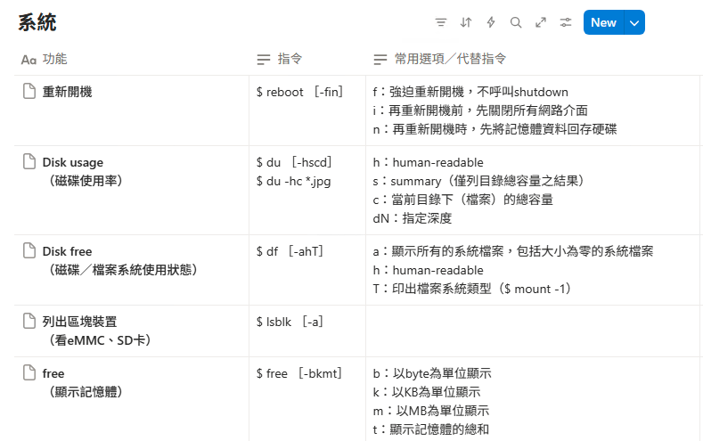

# 1. 了解linux 基本指令使用及運用

### [鳥哥私房菜，請都看過了解大致上原理，小測驗也可以](https://linux.vbird.org/linux_basic/centos7/)

在機器人的教材上有提到如何**在Linux 系統上使用 crontab 工作排程**，設定讓系統定時自動執行指定的指令或程式。

一般指令格式：**$ 指令 \[選項] \[選項值]**

常用指令整理如下↓

常用指令整理如下↓

[系統](https://www.notion.so/ff8c7a98c5d546b5b26f07d7542b6911?pvs=21)

<figure><figcaption></figcaption></figure>

[帳戶管理](https://www.notion.so/2d032f8e4b674809984315b3240468b7?pvs=21)

<figure><figcaption></figcaption></figure>

[檔案管理](https://www.notion.so/a523804496ae4caa8779950cb0fffe59?pvs=21)

<figure><figcaption></figcaption></figure>

<figure><figcaption></figcaption></figure>

[查看處理程序](https://www.notion.so/9110fa14aeca469b81fa765ea6fb7314?pvs=21)

<figure><figcaption></figcaption></figure>

[網際網路相關操作](https://www.notion.so/93de7dffce3b41acbc612a8e5430837f?pvs=21)

<figure><figcaption></figcaption></figure>
